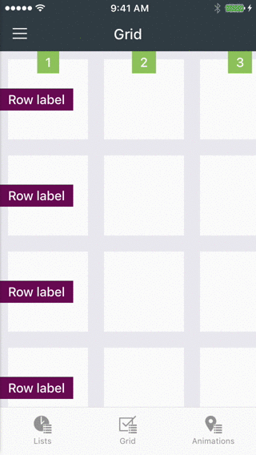

# react-native-directed-scrollview



A natively implemented scrollview component which lets you specify different scroll directions for child content.

The iOS implementation extends the default UIScrollView component, whereas the Android implementation is custom and aims to provide some limited parity with the iOS api.

The following props are supported:

| Prop | Default | Description |
| --- | --- | --- |
| `scrollEnabled` | `true` | When false, the view cannot be scrolled via touch interaction. |
| `minimumZoomScale` | `1.0` | How far the content can zoom out. |
| `maximumZoomScale` | `1.0` | How far the content can zoom in. |
| `bounces` | `true` | Whether content bounces at the limits when scrolling. |
| `bouncesZoom` | `true` | Whether content bounces at the limits when zooming. |
| `alwaysBounceHorizontal` | `true` | When `bounces` is enabled, content will bounce Horizontaly. |
| `alwaysBounceVertical` | `true` | When `bounces` is enabled, content will bounce Verticaly. |
| **ios** `showsVerticalScrollIndicator` | `true` | Whether vertical scroll bars are visible. |
| **ios** `showsHorizontalScrollIndicator` | `true` | Whether horizontal scroll bars are visible. |

The following methods are supported:

| Method | Example | Description |
| --- | --- | --- |
| `scrollTo` | `scrollTo({x: 100, y: 100, animated: true})` | Scrolls to a given x and y offset. |

## Installation

- `npm install react-native-directed-scrollview --save`
- `react-native link` (or `rnpm link`)

## Usage

To work properly this component requires that a fixed-size content container be specified through the **contentContainerStyle** prop.

```javascript
import ScrollView, { ScrollViewChild } from 'react-native-directed-scrollview';
...

export default class Example extends Component {
  render() {
    return (
      <ScrollView
        bounces={true}
        bouncesZoom={true}
        maximumZoomScale={2.0}
        minimumZoomScale={0.5}
        showsHorizontalScrollIndicator={false}
        showsVerticalScrollIndicator={false}
        contentContainerStyle={styles.contentContainer}
        style={styles.container}
      >
        <ScrollViewChild scrollDirection={'both'}>
          // multi-directional scrolling content here...      
        </ScrollViewChild>
        <ScrollViewChild scrollDirection={'vertical'}>
          // vertically scrolling content here...      
        </ScrollViewChild>
        <ScrollViewChild scrollDirection={'horizontal'}>
          // horizontally scrolling content here...      
        </ScrollViewChild>
      </ScrollView>
    );
  }
}

const styles = StyleSheet.create({
  container: {
    flex: 1,
  },
  contentContainer: {
    height: 1000,
    width: 1000,
  },
})
```

See the [example project](https://github.com/chrisfisher/react-native-directed-scrollview/tree/master/example) for more detail.
